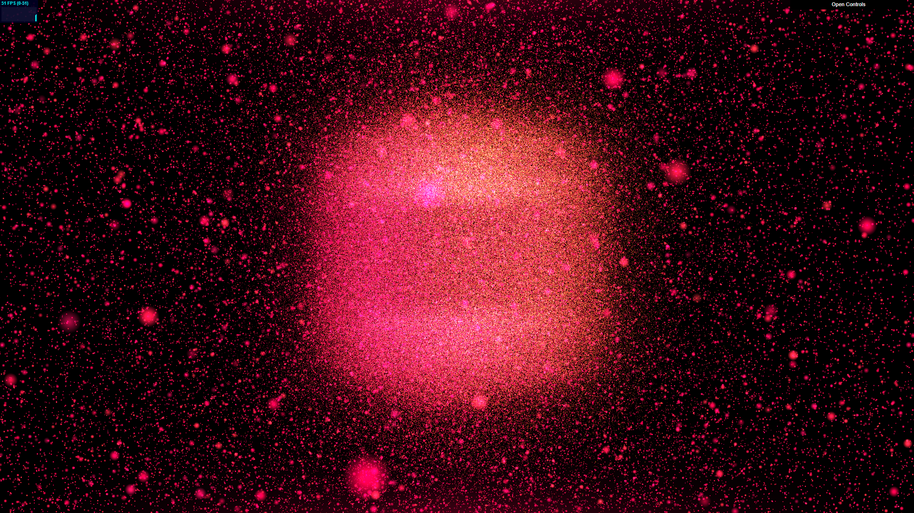

# CIS 566 Project 6: Particle System

* University of Pennsylvania
* pennkey : byumjin
* name : [Byumjin Kim](https://github.com/byumjin)

## Live Demo

| They are a million! |
| --- |
|  |
|  |

* [WebGL Link](https://byumjin.github.io/WebGL2-GPU-Particle/)

- Used number of particles : 1,048,576 (1024 x 1024)
- Volume up!

### GUI

- AutoPlay : It shows pre-ordered scenes. Recommend to use it.

- MaxSpeed : The max speed of each particle
- ParticleSize : The size of each Particle quad
- Alpha : The alpha of each Particle

- ColorScheme : The use can choose one of pre-defined color schemes
- Shape : The shape of mesh which attracts particles
- Background : Setting force-field for background particles

## GPU particle

If we try to implement particle system on CPU side, we can't create a bunch of particles because of the limitation of available threads.
To address this issue, we can use GPU to simulate our particles. Because, like a physics simulation, each particle can be simulated individually.
But, the problem is WebGL2 is still not supporting compute shader. So, we can implement this with using only vertex and fragment shader. (Actually, we can also use transform feedback, and it might be more efficient)

First, we need to use textures for storing our particles' information. In other words, each texel has its one particle's information. Thus, the resolution of textures equals the number of controlable particles.
For this project, I use Runge-Kutta's intergration method. So, I needed 6 textures for velocity, velocityPrime, position, positionPrime, prevVelocity, prevPosition. (If I use Euler intergration, it needs only 2 textures for velocity and position)
But, if I use one framebuffer for each texture, it will make slow performance. To handle this, I drew multiple render targets (I used 2 additional frame buffers for simulating particles, one for velocityPrime, positionPrime, prevVelocity, prevPosition, another for velocity, position) at once like deferred rendering.

In vertex shader, each instanced quad takes exact one pixel of texture. In fragment shader, it uses its particle information from particle information textures with its' same UV coordinates.

## Procedural coloration and shaping of particles

This project uses 3 color schemes called Macaroon, Magenta, Jungle.
Basically, colors are determined by mesh's UV coordinates and elapsed time.
And, the alpha value follows the velocity of its particle. 

## Interactive forces

Like Nop Jiarathanakul's [Particle Dream application](http://www.iamnop.com/particles/), Left click attracts the around particles and Right Click repels them.
To do this, it ray-traced to an infinite plane, which cross the origin, from the camera when the user clicks the screen.
And, apply the right force to interact with our particles.

When the user chooses a mesh to pop up, there are remained particles which wonder the background.
These particles will follow one of the pre-defined force-field what the user chooses from GUI.

## Mesh surface attraction

Just followed [the instruction](https://github.com/CIS-566-2018/homework-6-particle-system-eldu).

## Reference

[Particle Dream application](http://www.iamnop.com/particles/)

